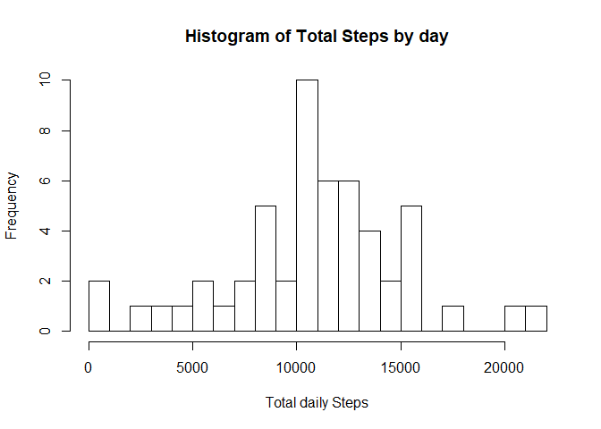
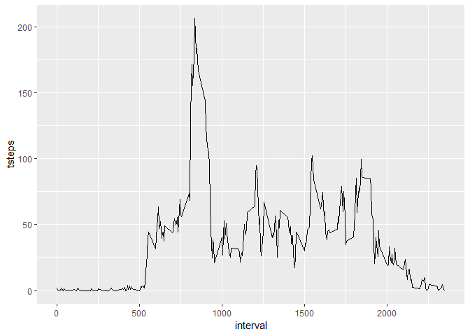
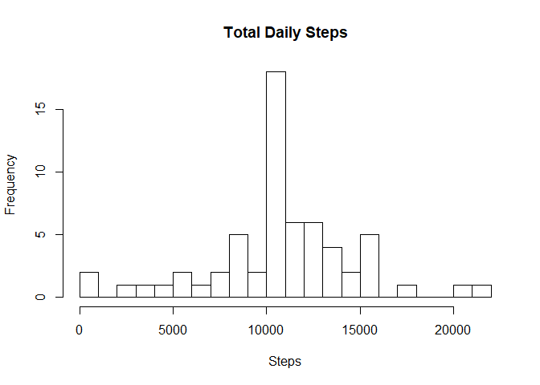
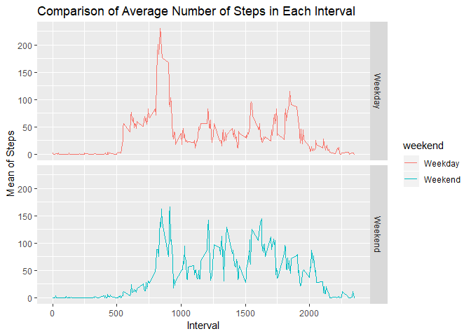

## Loading and preprocessing the data

```r
download.file("https://d396qusza40orc.cloudfront.net/repdata%2Fdata%2Factivity.zip", destfile = "activity.zip", mode="wb")
unzip("activity.zip")
steps <- read.csv("activity.csv", header = TRUE)
head(steps)
```

```
##   steps       date interval
## 1    NA 2012-10-01        0
## 2    NA 2012-10-01        5
## 3    NA 2012-10-01       10
## 4    NA 2012-10-01       15
## 5    NA 2012-10-01       20
## 6    NA 2012-10-01       25
```


## What is mean total number of steps taken per day?

```r
library(magrittr)
library(dplyr)
```

```
## 
## Attaching package: 'dplyr'
```

```
## The following objects are masked from 'package:stats':
## 
##     filter, lag
```

```
## The following objects are masked from 'package:base':
## 
##     intersect, setdiff, setequal, union
```

```r
data_date <- steps %>% select(date, steps) %>% group_by(date) %>% summarize(tsteps= sum(steps)) %>%na.omit()

hist(data_date$tsteps, xlab = "Total daily Steps",main="Histogram of Total Steps by day", breaks = 20)
```

<!-- -->

```r
mean(data_date$tsteps)
```

```
## [1] 10766.19
```

```r
median(data_date$tsteps)
```

```
## [1] 10765
```


## What is the average daily activity pattern?

```r
library(ggplot2)
data_interval <- steps%>% select(interval, steps) %>% na.omit() %>% group_by(interval) %>% summarize(tsteps= mean(steps)) 
ggplot(data_interval, aes(x=interval, y=tsteps))+ geom_line()
```

<!-- -->

```r
data_interval[which(data_interval$tsteps== max(data_interval$tsteps)),]
```

```
## # A tibble: 1 x 2
##   interval tsteps
##      <int>  <dbl>
## 1      835   206.
```


## Imputing missing values

```r
# generate listing of NA's
values_missing <- sum(is.na(data))
```

```
## Warning in is.na(data): is.na() applied to non-(list or vector) of type
## 'closure'
```

```r
values_missing
```

```
## [1] 0
```

```r
mean_replacements <- function(x) replace(x, is.na(x), mean(x, na.rm = TRUE))
data_mean <- steps%>% group_by(interval) %>% mutate(steps= mean_replacements(steps))
head(data_mean)
```

```
## # A tibble: 6 x 3
## # Groups:   interval [6]
##    steps date       interval
##    <dbl> <fct>         <int>
## 1 1.72   2012-10-01        0
## 2 0.340  2012-10-01        5
## 3 0.132  2012-10-01       10
## 4 0.151  2012-10-01       15
## 5 0.0755 2012-10-01       20
## 6 2.09   2012-10-01       25
```

```r
data_day <- aggregate(data_mean$steps, by=list(data_mean$date), sum)

names(data_day)[1] ="date"
names(data_day)[2] ="totalsteps"
head(data_day,15)
```

```
##          date totalsteps
## 1  2012-10-01   10766.19
## 2  2012-10-02     126.00
## 3  2012-10-03   11352.00
## 4  2012-10-04   12116.00
## 5  2012-10-05   13294.00
## 6  2012-10-06   15420.00
## 7  2012-10-07   11015.00
## 8  2012-10-08   10766.19
## 9  2012-10-09   12811.00
## 10 2012-10-10    9900.00
## 11 2012-10-11   10304.00
## 12 2012-10-12   17382.00
## 13 2012-10-13   12426.00
## 14 2012-10-14   15098.00
## 15 2012-10-15   10139.00
```

```r
summary(data_day)
```

```
##          date      totalsteps   
##  2012-10-01: 1   Min.   :   41  
##  2012-10-02: 1   1st Qu.: 9819  
##  2012-10-03: 1   Median :10766  
##  2012-10-04: 1   Mean   :10766  
##  2012-10-05: 1   3rd Qu.:12811  
##  2012-10-06: 1   Max.   :21194  
##  (Other)   :55
```

```r
hist(data_day$totalsteps, xlab = "Steps", ylab = "Frequency", main = "Total Daily Steps", breaks = 20)
```

<!-- -->

```r
old_mean <- mean(data_date$tsteps, na.rm = TRUE)
new_mean <- mean(data_day$totalsteps)
# Old mean and New mean
old_mean
```

```
## [1] 10766.19
```

```r
new_mean
```

```
## [1] 10766.19
```

```r
old_median <- median(data_date$tsteps, na.rm = TRUE)
new_median <- median(data_day$totalsteps)
# Old median and New median
old_median
```

```
## [1] 10765
```

```r
new_median
```

```
## [1] 10766.19
```


## Are there differences in activity patterns between weekdays and weekends?

```r
data_mean$date <- as.Date(data_mean$date)
data_mean$weekday <- weekdays(data_mean$date)
data_mean$weekend <- ifelse(data_mean$weekday=="Saturday" | data_mean$weekday=="Sunday", "Weekend", "Weekday" )

library(ggplot2)
data_meanweekendweekday <- aggregate(data_mean$steps , by= list(data_mean$weekend, data_mean$interval), na.omit(mean))
names(data_meanweekendweekday) <- c("weekend", "interval", "steps")

ggplot(data_meanweekendweekday, aes(x=interval, y=steps, color=weekend)) + geom_line()+
  facet_grid(weekend ~.) + xlab("Interval") + ylab("Mean of Steps") +
  ggtitle("Comparison of Average Number of Steps in Each Interval")
```

<!-- -->
